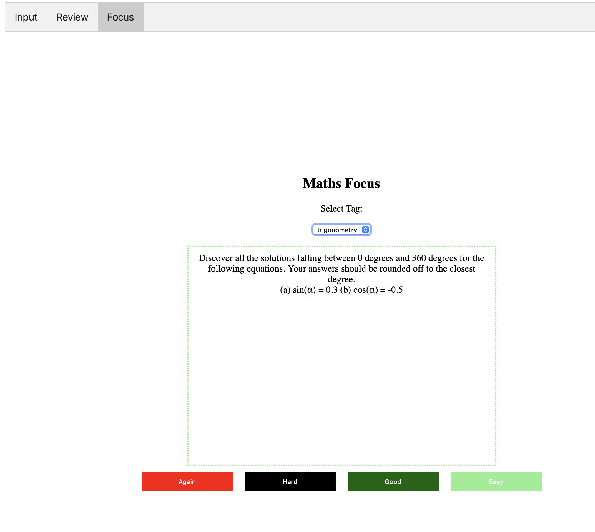

# MathsPrompt

A simple tool that schedules maths problems to be solved.

## Input Questions

For the initial input of basis questions, spin up the Rust server from the base
directory with a simple `cargo run`. This will start the server on port 8000.

Then, open the file at `fontend/index.html` in your browser. (You'll want to 
set your database URL using the `MATHSPROMPT_DATABASE_URL` environment variable,
and you'll want to set your OpenAI API key using the `OPENAI_API_KEY`
environment variable.)

## Question Variant Autogeneration

When a question is successfully input into the Postgres database, the server
then queries the OpenAI API to generate a number of variants of the question.
These are then inserted into the database as well (with a label to indicate that
they have been autogenerated).

## Setting up the database

You can set up the database by using the SQL commands in `database/create_tables.sql`.
